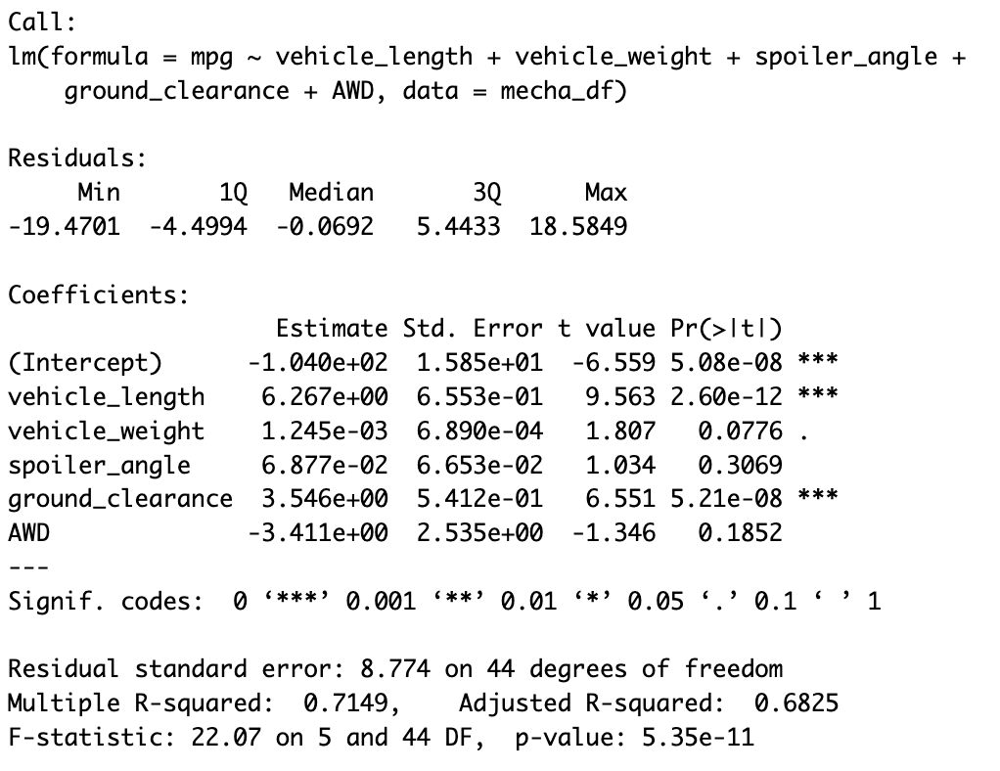

# R_Analysis

## Linear Regression to Predict MPG

 

There are two variables that provide a non-random amount of variance to mpg values in this dataset:
1. The vehicle length (p = 2.6*10^-12)
2. The ground clearance (p = 5.21*10^-8)
Note that the vehicle weight is approaching statistical significance, however does not reach less than 0.05 for a p-value. 
Also note that the intercept is statistically significant which means that other factors not included in this analysis are contributing to non-random variance in mpg. 

The slope of this linear model is not considered to be zero. This is because the null hypothesis of linear regression testing is that the slope of the linear model is 0. As our p-value in this model is low enough to reject the null hypothesis, (p = 5.35*10^-11) we can state that the slope is not 0 thereby accepting our alternative hypothesis. 

This linear model does predict the mpg of MechaCar prototypes effectively as our R-Squared value is 0.72. With that in mind however, the lack of significant variables here might be evidence of an overfit model. Additionally, our adjusted R-Squared value, which controls for the number of predictors in the model is lower and decreases when a predictor improves the model by less than expected. 

## Summary Statistics on Suspension Coils

 

As can be seen above, the variance for all lots analyzed together is less than the 100 pounds per square inch cut-off for MechaCar's design specifications (var = 62.29).

 

However, when we analyze lot by lot it becomes clear that the variance for lot number 3 (var = 170.29) is much higher than the 100 pounds per square inch cut-off for variance. Lot 1 and 2 meet the design specifications, but the third lot seems to have too high a variance to meet the requirements. 

## T-Tests on Suspension Coils

### Entire Dataset:

In this section, I qualitatively (using ggplot) and quantitatively (using the shapiro-wilk test) analyzed for normality before proceeding with a one sample t-test. Interestingly, the shapiro-wilk test for lots 1 and 3 both had p-values less than 0.05, whereas lot 2 had a p-value of 0.33 indicating that the only dataset here that is normality distributed is the latter.  

 

When analyzing the PSI measurements against a mu of 1500, we can see that the p-value is 0.06 and thus not at a level to reject the null hypothesis. This means that we believe the mean PSI of this dataset is no different (and therefore equal) than the average of 1500. 

### Lots 1-3: 

 

As can be seen above, the p-value for testing on Lot 1 returns a p-value of 1 and the null hypothesis is not rejected similar to the complete dataset case above. 

 

The p-value for this t-test (0.607) on lot 2 also depicts a scenario that the PSI mean of this lot is no different to the population mean of 1500 pounds per square inch. 

 

In this lot, the p-value is below a significance threshold of 0.05 (p = 0.042) and we can reject the null hypothesis, and accept the alternative stating that the true mean in this lot is not equal to the population mean of 1500 pounds PSI. 

## Study Design: MechaCar vs Competition

Another statistical study can be performed to quantify how MechaCar performs against the competition. In this study, I would use the metric (dependent variable) of highway fuel efficiency as per rising gasoline prices. I would conduct a multiple linear regression model because I would like to use the following multiple independent variables: horsepower, miles per gallon (MPG), vehicle weight and number of cylinders. The null hypothesis (H0) would be that the slope of this linear model is 0. 

